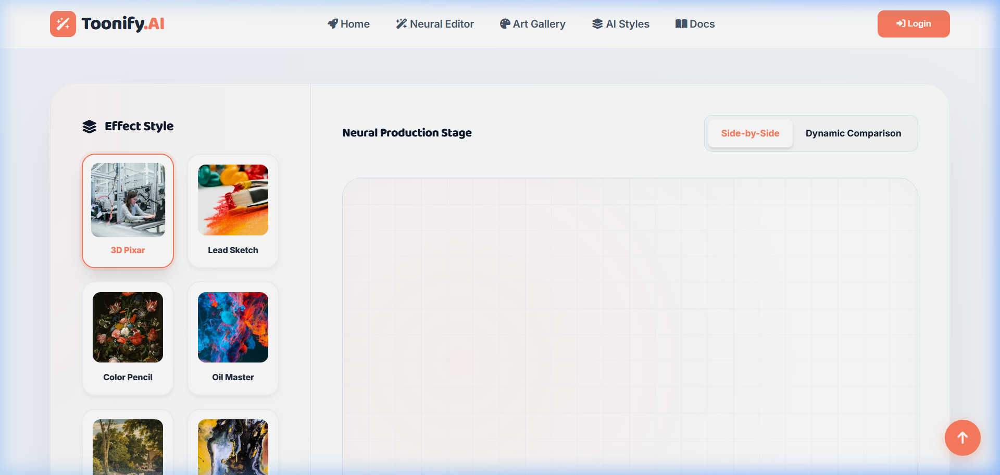
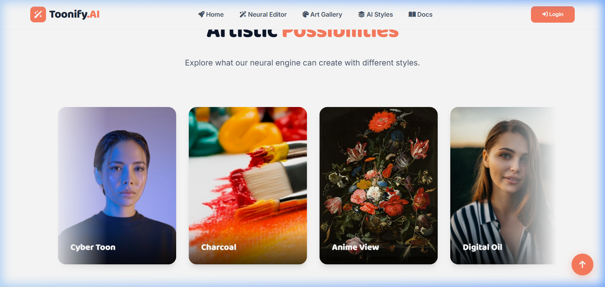
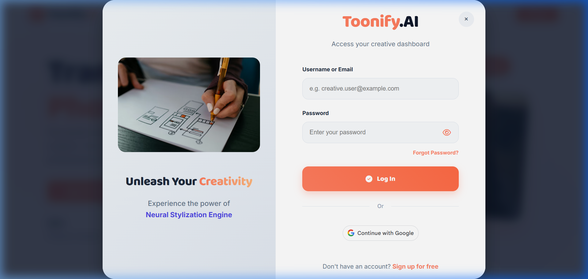
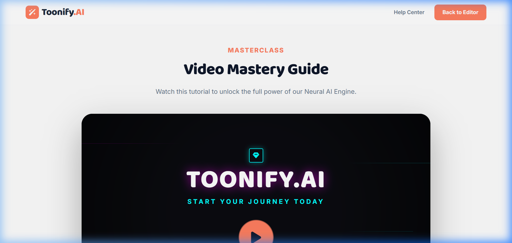

# <p align="center">🎨 Toonify AI - Professional Image Stylization Platform 🤖</p>

<p align="center">
  
</p>

<p align="center">
  
  
  
  
</p>

---

<p align="center">
  <strong>Transform your photos into stunning artistic masterpieces using advanced neural calculations and high-performance OpenCV algorithms.</strong>
</p>

<p align="center">
  <a href="https://toonify-ai-saas.onrender.com/"><strong>🚀 Live Demo: toonify-ai-saas.onrender.com</strong></a>
</p>

---

## 📸 Visual Preview

<p align="center">
  
  
</p>

<p align="center">
  <em>The Neural Production Stage and available Artistic Stylization effects.</em>
</p>

---

## ✨ Key Features

### ⚡ 1. Neural Batch System
*   **Parallel Processing**: Upload multiple images and apply different styles to each in a single batch.
*   **Dynamic Queue**: Real-time management of your processing queue with individual style selection.
*   **Real-time Feedback**: Visual status tracking for every image in the batch.

### 🧠 2. Neural Stylization Engine
*   **High-Fidelity Engine**: Optimized recursive edge-preserving filters for stunning, sharp artistic results.
*   **A/B Comparison**: Dynamic slider and side-by-side view to witness the artistic evolution.
*   **Neural Statistics**: In-depth analysis of **Brightness, Contrast, and Color Distribution** for every generation.

### 💰 3. Premium Monetization
*   **Instant Exports**: Integrated **Razorpay** for HD exports and Pro subscriptions.
*   **Multi-Format Exports**: Save your art in **JPG, PNG, or professional PDF**.
*   **Secure Access**: Temporary signed download links and server-side caching for instant delivery.

### 🔒 4. Personal Creative Vault
*   **Neural History**: A comprehensive, paginated gallery of all your past creations.
*   **Secure Privacy**: "Neural Burn" (Danger Zone) for permanent data wiping.
*   **Smart Management**: Bulk recovery and automated cleanup settings.

---

## 🛠️ Tech Stack

| Backend | Frontend | Database & Security |
| :--- | :--- | :--- |
|  |  |  |
|  |  |  |
|  |  |  |

---

## 🚀 Installation & Setup

1️⃣ **Clone the repository**
```bash
git clone https://github.com/pruthvirajtarode/AI-Powered-Image-Stylization-and-Cartoonization-Platform.git
cd AI-Powered-Image-Stylization-and-Cartoonization-Platform
```

2️⃣ **Configure Environment**
*   Create a `.env` file in the `backend/` directory from `.env.example`.
*   Update your API keys (Google, Razorpay, etc.).

3️⃣ **Run Automated Setup (Windows)**
```powershell
./setup.bat
```
*Manual Setup:* `pip install -r backend/requirements.txt`

4️⃣ **Launch the Platform**
```bash
python backend/backend.py
```
*Dashboards will be live at `http://localhost:5000`*

---

## 🎨 System Architecture
See the detailed [System Flowchart](docs/FLOWCHART.md) for a technical breakdown of the processing pipeline.

---

## 🎨 Dashboard Tour

<p align="center">
  
</p>

*   **Home**: Upload directly via Drag-and-Drop or Camera Capture.
*   **Dashboard**: View your Account Statistics, Favorite Styles, and Lifetime Spend.
*   **Vault**: Search through your historical art pieces and manage your exports.
*   **Profile**: Multi-layer security settings including Password Rotations.

---

## 📚 Learning & Resources

<p align="center">
  
</p>

*   Detailed [User Guide](docs/user_guide.md) for getting started.
*   Technical [Developer Guide](docs/developer_guide.md) for contributors.
*   [Flowchart](docs/FLOWCHART.md) for deep-dive into the AI pipeline.

---

<p align="center">
  Made with ❤️ by <strong>Pruthviraj Tarode</strong>
</p>
