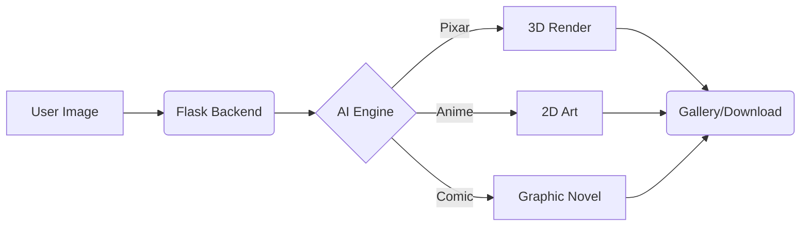

# <p align="center">🎨 Toonify AI</p>

<p align="center">
  <strong>Transforming Reality into Art with AI-Powered Stylization</strong>
</p>

<p align="center">
  
</p>

<p align="center">
  <a href="https://toonify.live/"><strong>✨ Live Demo</strong></a>
  •
  <a href="docs/user_guide.md"><strong>📖 User Guide</strong></a>
  •
  <a href="docs/developer_guide.md"><strong>💻 Dev Guide</strong></a>
</p>

<p align="center">
  
  
  
  
  
</p>

---

## 🚀 The Product

**Toonify AI** is a professional-grade image stylization platform that bridges the gap between raw photography and AI-generated art. Designed for creators, it provides a seamless workflow from local uploads to high-fidelity artistic renders.

### 🌟 Key Highlights
- **9+ Unique AI Styles**: From Pixar-style 3D to Classic Anime and Comic Book aesthetics.
- **Batch Processing**: Stylize entire collections in one go with optimized backend workers.
- **Creator Dashboard**: Real-time analytics, spend tracking, and style preferences at your fingertips.
- **Secure Payments**: Industry-standard integration with Razorpay for premium features.
- **AR & Social Ready**: Support for AR camera filters and social-media-ready exports.

---

## 🎭 Style Showcase

<table align="center">
  <tr>
    <td align="center"><b>Original</b></td>
    <td align="center"><b>Pixar Style</b></td>
    <td align="center"><b>Anime Style</b></td>
    <td align="center"><b>Comic Style</b></td>
  </tr>
  <tr>
    <td></td>
    <td></td>
    <td></td>
    <td></td>
  </tr>
</table>

<p align="center"><em>Experience high-fidelity transformations with consistent character retention.</em></p>

---

## 🛠️ Performance & Modules

| Feature | Description |
| :--- | :--- |
| **Neural Editor** | Interactive playground providing real-time filters and granular control. |
| **Batch Pipeline** | Process massive datasets with our high-throughput backend architecture. |
| **Creator Analytics** | Detailed insights into stylization stats, favorites, and usage history. |
| **Secure Billing** | Fully transparent payment history and premium access management. |
| **Documentation Hub** | Extensive guides for both end-users and technical architects. |

---

## 💻 Tech Stack & Architecture

- **Core Engine**: Python 🐍, Flask 🔥, OpenCV 👁️
- **Frontend**: Modern HTML5, Responsive CSS3 (Glassmorphism), Vanilla JavaScript
- **Data Layer**: PostgreSQL (Production) / SQLite (Development)
- **Deployment**: Docker 🐳, Gunicorn, Render CI/CD
- **Security**: Bcrypt Hashing, OAuth 2.0, Session-based Auth


```mermaid
graph LR
    A[User Image] --> B(Flask Backend)
    B --> C{AI Engine}
    C -->|Pixar| D[3D Render]
    C -->|Anime| E[2D Art]
    C -->|Comic| F[Graphic Novel]
    D & E & F --> G(Gallery/Download)
```

---

## ⚡ Quick Start

### 1. Clone & Initialize
```bash
git clone https://github.com/pruthvirajtarode/AI-Powered-Image-Stylization-and-Cartoonization-Platform.git
cd AI-Powered-Image-Stylization-and-Cartoonization-Platform
```

### 2. Integrated Setup
Run the automated setup script to configure dependencies, virtual environment, and initial data:
```powershell
./setup.bat
```

### 3. Launch App
```bash
python backend/backend.py
```
> **Note**: Access your local instance at `http://localhost:5000`. Ensure your `.env` is configured with valid API keys for Google OAuth and Razorpay.

---

## 🤝 Contributing & Community

We believe in the power of open-source! Whether you're fixing a bug or suggesting a new AI style, your input is welcome.
- 🐛 **Bugs**: Open an [Issue](https://github.com/pruthvirajtarode/AI-Powered-Image-Stylization-and-Cartoonization-Platform/issues).
- ✨ **Features**: Start a [Discussion](https://github.com/pruthvirajtarode/AI-Powered-Image-Stylization-and-Cartoonization-Platform/discussions).
- 🛠️ **PRs**: Keep them scoped and document any UI changes with screenshots.

---

<p align="center">
  <strong>Crafted with ❤️ by Pruthviraj Tarode</strong>
</p>

<p align="center">
  <a href="https://github.com/pruthvirajtarode"></a>
  <a href="https://www.linkedin.com/in/pruthviraj-tarode/"></a>
</p>
