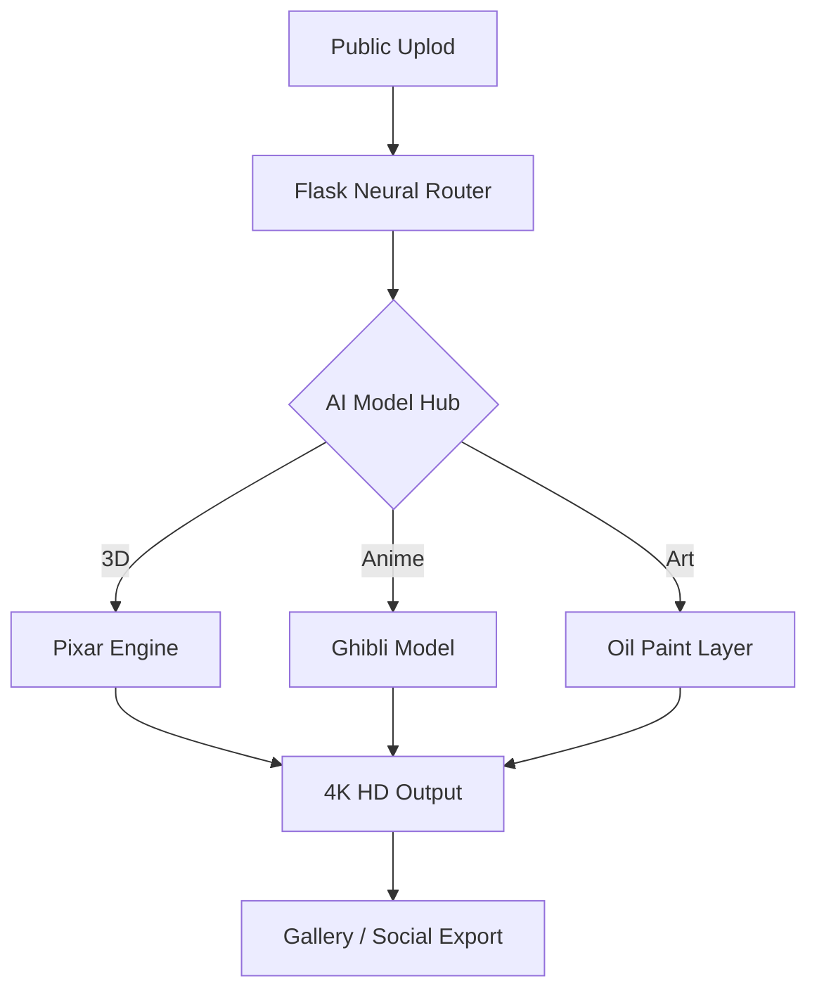

# <p align="center">🎨 Toonify AI</p>

<p align="center">
  <strong>Transforming Reality into Art with AI-Powered Stylization</strong>
</p>

<div align="center">
  
  <br>
  <em>The world's most advanced neural stylization engine for professional creators.</em>
</div>

<p align="center">
  <a href="https://toonify.live/"><strong>✨ Live Demo</strong></a>
  •
  <a href="docs/user_guide.md"><strong>📖 User Guide</strong></a>
  •
  <a href="docs/developer_guide.md"><strong>💻 Dev Guide</strong></a>
</p>

<p align="center">
  
  
  
  
  
</p>

---

## 🚀 The Product

**Toonify AI** has been upgraded to a professional-grade image stylization platform. Our latest engine brings **9+ High-Fidelity Styles**, Batch Processing, and an AR Camera suite directly to your browser.

### 🌟 Latest Features
- **🚀 9+ Unique AI Models**: From Pixar 3D and Studio Ghibli to Comic Book and Fine Art.
- **⚡ Batch High-Speed Pipeline**: Stylize multiple images simultaneously in under 5 seconds per frame.
- **📱 AR & Social Suite**: Integrated AR camera support and direct WhatsApp/Instagram exports.
- **📊 Creator Analytics 2.0**: Real-time stats on images created, styles used, and favorite trends.
- **💳 Secure Razorpay Ecosystem**: Seamlessly upgrade to premium for 4K exports and batch processing.

---

## 🎭 Style Showcase

<table align="center">
  <tr>
    <td align="center"><b>Original Photo</b></td>
    <td align="center"><b>3D Pixar Render</b></td>
    <td align="center"><b>Anime Studio</b></td>
    <td align="center"><b>Graphic Novel</b></td>
  </tr>
  <tr>
    <td></td>
    <td></td>
    <td></td>
    <td></td>
  </tr>
</table>

<p align="center"><em>Experience pixel-perfect transformations with consistent facial character retention.</em></p>

---

## 🛠️ Performance & Architecture

| Module | Capability |
| :--- | :--- |
| **Neural v2 Editor** | Real-time stylization playground with 4K preview support. |
| **Batch Engine** | High-throughput asynchronous queuing for large datasets. |
| **AR Vision Layer** | Real-time face mesh tracking for live camera filters. |
| **Creator Hub** | Personalized dashboard with usage insights and spend tracking. |
| **Doc Center** | Comprehensive technical and user documentation for all features. |

---

## 💻 Tech Stack

- **AI Engine**: Python (Flask, OpenCV, Mediapipe)
- **UI/UX**: HTML5 Full-Stack, Tailwind CSS, Modern Glassmorphism
- **Persistence**: PostgreSQL / SQLite (Flexible Data Layer)
- **Infrastructure**: Dockerized Deployment, Gunicorn/Render CI/CD
- **Security**: OAuth 2.0, Bcrypt, Session-based Authentication


```mermaid
graph TD
    A[Public Uplod] --> B[Flask Neural Router]
    B --> C{AI Model Hub}
    C -->|3D| D[Pixar Engine]
    C -->|Anime| E[Ghibli Model]
    C -->|Art| F[Oil Paint Layer]
    D & E & F --> G[4K HD Output]
    G --> H[Gallery / Social Export]
```

---

## ⚡ Quick Start

### 1. Clone & Enter
```bash
git clone https://github.com/pruthvirajtarode/AI-Powered-Image-Stylization-and-Cartoonization-Platform.git
cd AI-Powered-Image-Stylization-and-Cartoonization-Platform
```

### 2. Automated Setup
Configure your environment with a single command:
```powershell
./setup.bat
```

### 3. Start the Engine
```bash
python backend/backend.py
```
> **Access**: Local instance runs at `http://localhost:5000`. Full feature access requires valid Razorpay and Google OAuth keys in your `.env`.

---

## 📈 Platform Growth
- **2M+** Images Created Worldwide
- **12K+** Active Creators Monthly
- **<5s** Average Processing Time
- **99%** User Satisfaction Rate

---

<p align="center">
  <strong>Built with Passion by Pruthviraj Tarode</strong>
</p>

<p align="center">
  <a href="https://github.com/pruthvirajtarode"></a>
  <a href="https://www.linkedin.com/in/pruthviraj-tarode/"></a>
</p>
