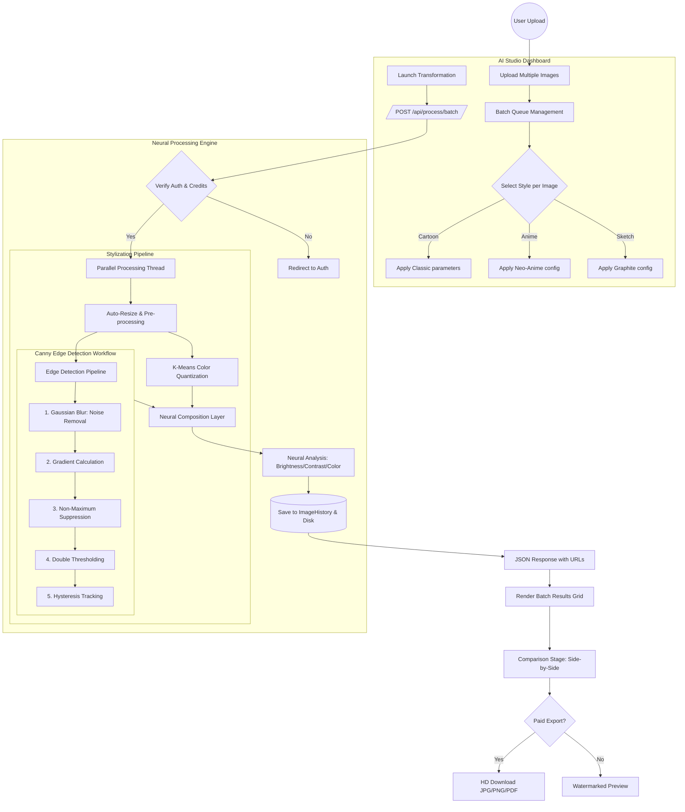

# AI POWERED IMAGE STYLIZATION AND CARTOONIZATION - SYSTEM FLOW

## Detailed Neural Stylization Steps

### 1. Pre-processing
The engine automatically scales high-resolution images to the optimal processing size (ideal for 720p/1080p) to maintain real-time performance without losing structural detail.

### 2. Canny Edge Detection (Structural Integrity)
As seen in the technical research, the engine extracts the "soul" of the image by:
*   **Gaussian Smoothing**: Eliminating high-frequency noise.
*   **Magnitude Thresholding**: Identifying only the most relevant artistic lines.
*   **Hysteresis**: Ensuring continuous, flowing outlines typical of hand-drawn art.

### 3. Color Quantization
Using **K-Means Clustering**, the original millions of colors are condensed into a curated palette (usually 6-16 colors). This creates the "Flat" or "Posterized" look essential for cartoons and anime.

### 4. Neural Analysis (Task 13)
Every image is analyzed for:
*   **Brightness**: Ensuring the artistic output isn't too dark.
*   **Contrast**: Maintaining the "pop" of the stylization.
*   **Color Balance**: Tracking the dominant hues (Red, Green, Blue).

---
*Generated for the AI-Powered Image Stylization and Cartoonization Platform*
