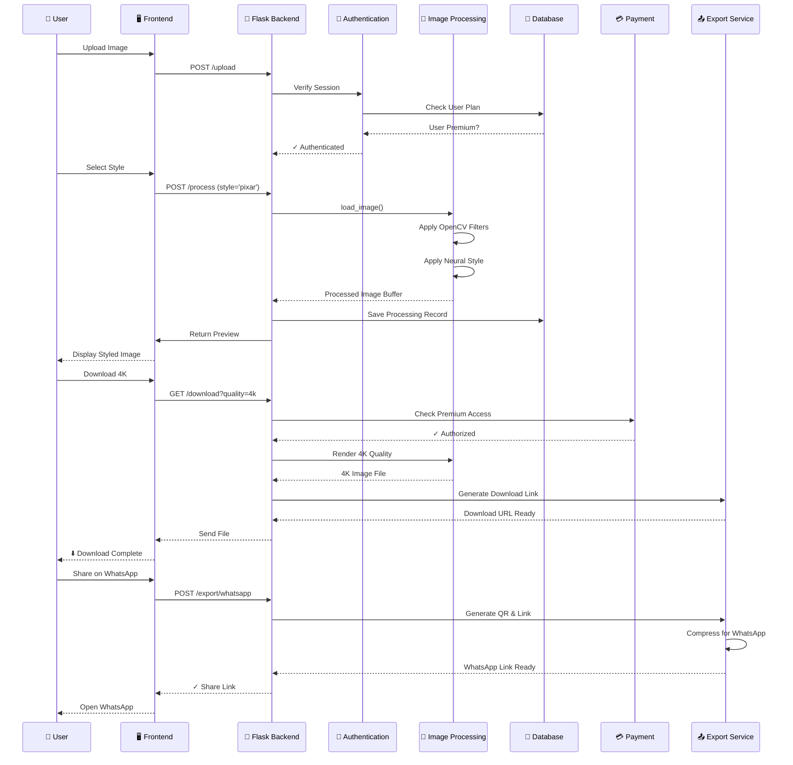

# Sequence Diagram - Image Stylization Flow

## Description
This sequence diagram shows the interactions between different components during:
1. **Image Upload & Authentication**: User authenticates and uploads an image
2. **Image Processing**: The image is processed with the selected AI style
3. **Download with Quality Check**: Premium users can download 4K images
4. **Social Media Export**: Users can share stylized images via WhatsApp
