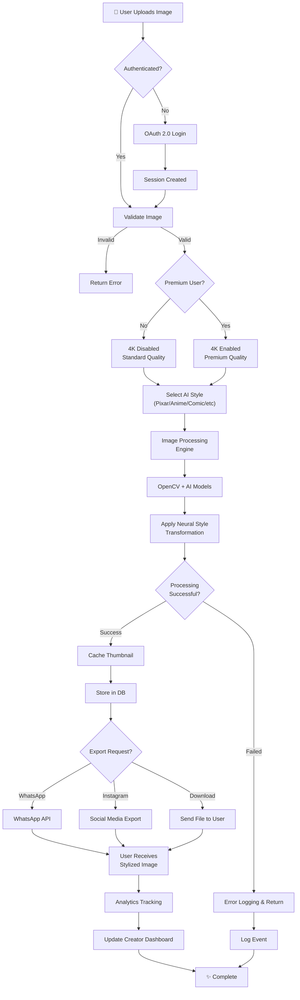

# System Workflow Diagram - Toonify AI

```mermaid
graph TD
    A["👤 User Uploads Image"] --> B{"Authenticated?"}
    B -->|No| C["OAuth 2.0 Login"]
    C --> D["Session Created"]
    B -->|Yes| E["Validate Image"]
    D --> E
    E -->|Invalid| F["Return Error"]
    E -->|Valid| G{"Premium User?"}
    G -->|No| H["4K Disabled<br/>Standard Quality"]
    G -->|Yes| I["4K Enabled<br/>Premium Quality"]
    H --> J["Select AI Style<br/>(Pixar/Anime/Comic/etc)"]
    I --> J
    J --> K["Image Processing<br/>Engine"]
    K --> L["OpenCV + AI Models"]
    L --> M["Apply Neural Style<br/>Transformation"]
    M --> N{"Processing<br/>Successful?"}
    N -->|Failed| O["Error Logging & Return"]
    N -->|Success| P["Cache Thumbnail"]
    P --> Q["Store in DB"]
    Q --> R{"Export Request?"}
    R -->|WhatsApp| S["WhatsApp API"]
    R -->|Instagram| T["Social Media Export"]
    R -->|Download| U["Send File to User"]
    S --> V["User Receives<br/>Stylized Image"]
    T --> V
    U --> V
    V --> W["Analytics Tracking"]
    W --> X["Update Creator Dashboard"]
    X --> Y["✨ Complete"]
    O --> Z["Log Event"]
    Z --> Y
```

## Description
This workflow shows the complete journey of an image through the Toonify AI system, from upload to delivery.
