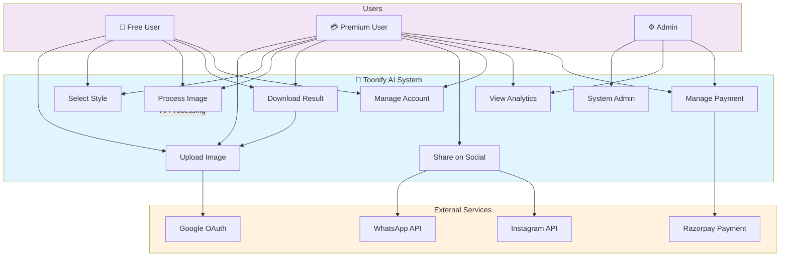

# Use Case Diagram - Toonify AI

## Description
- **Free Users**: Can upload, select styles, process images, download standard quality, and manage accounts
- **Premium Users**: Have access to all features including 4K downloads, social sharing, and analytics
- **Admin**: Manages system, views analytics, and payment processing
- **External Services**: Integration with Google OAuth, Razorpay, WhatsApp, and Instagram APIs
